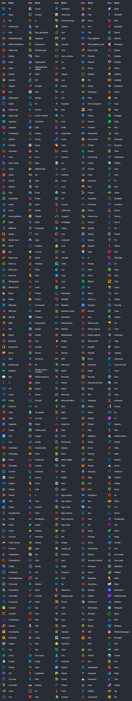
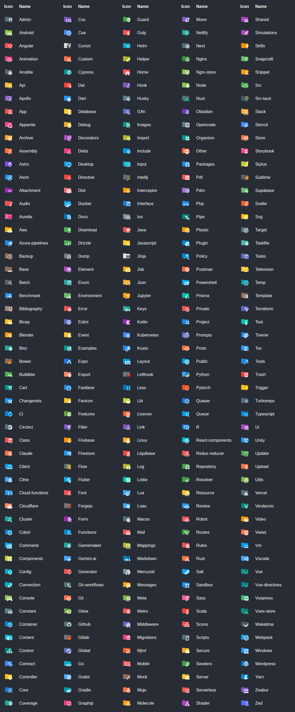
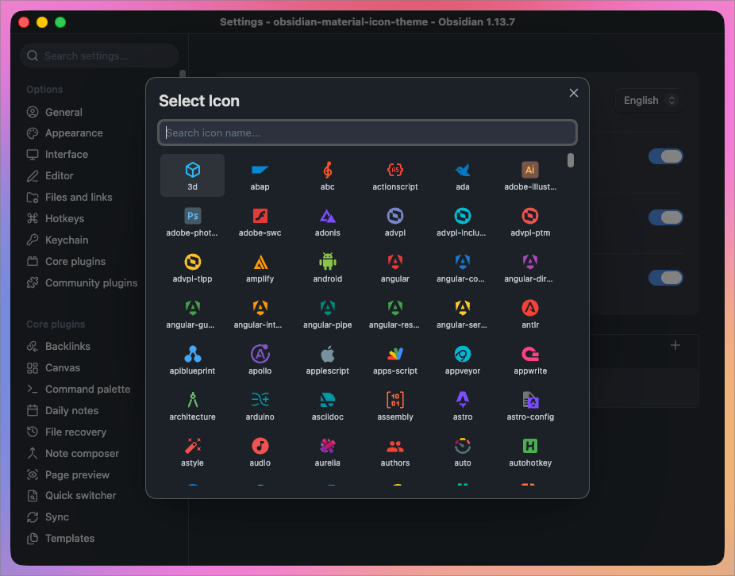

<!-- markdownlint-disable -->

<p align="center">
  
</p>

<h1 align="center">Material Icon Theme</h1>

<p align="center"><em>Material Design icons for Obsidian</em></p>

<p align="center">
  <a href="https://github.com/GilbertzzzZZ/obsidian-material-icon-theme/releases"></a>
  <a href="https://github.com/GilbertzzzZZ/obsidian-material-icon-theme"></a>
  <a href="LICENSE"></a>
</p>

<p align="center"><b>English</b> | <a href="README-zh.md">简体中文</a></p>

<br />

<p align="center">
  
</p>

### File icons

<details><summary>🏞️ <b>Show all available file icons</b></summary><br/></details>

### Folder icons

<details><summary>🏞️ <b>Show all available folder icons</b></summary><br/></details>

<br />

## Table of Contents

- [Features](#features)
- [Getting Started](#getting-started)
- [Customization](#customization)
- [Icon matching](#icon-matching)
- [Development](#development)
- [Icon sources](#icon-sources)
- [Contributing](#contributing)
- [License](#license)

## Features

- Material Design file & folder icons for the Obsidian file explorer
- 1125 icons covering 2131 file names, 1380 extensions and 269 folder names
- Custom icon associations through a searchable picker
- Independent toggles for file and folder icons
- Settings UI in 10 languages
- Easy to use, and it follows your light / dark theme live

## Getting Started

> Requires Obsidian 1.13.0 or newer.

1. **Install the plugin**<br>
  Download `main.js`, `manifest.json` and `styles.css` from [Releases](https://github.com/GilbertzzzZZ/obsidian-material-icon-theme/releases) into `.obsidian/plugins/material-icon-theme/`.

2. **Enable the plugin**<br>
  Open **Settings → Community plugins** and turn on **Material Icon Theme**.

3. **Enjoy your new icons**<br>
  The file explorer picks them up immediately — no restart needed.

> Release tags match `manifest.json` exactly (e.g. `1.0.0`, not `v1.0.0`), as Obsidian requires.

### Build from source

```bash
git clone https://github.com/GilbertzzzZZ/obsidian-material-icon-theme.git
cd obsidian-material-icon-theme
npm install
npm run build
cp main.js manifest.json styles.css /path/to/vault/.obsidian/plugins/material-icon-theme/
```

## Customization

Everything lives under **Settings → Material Icon Theme**.

<p align="center">
  
</p>

### File & folder icon toggles

File icons and folder icons switch on and off independently. Turning either off hands that half of the explorer back to your theme's own icons.

### Custom icon associations

Map any file extension to any icon in the library. Custom rules take priority over every built-in match while enabled.

<p align="center">
  
</p>

Enter the extension without its leading dot (`vue`, `rs`, `myext`), then pick an icon. Compound extensions work as well — a rule for `d.ts` wins over one for `ts`.

Search the full library by name when choosing:

<p align="center">
  
</p>

### Interface language

The settings UI ships in English, 简体中文, 繁體中文, 日本語, 한국어, Deutsch, Français, Español, Русский and Português, switchable from the top of the settings tab.

## Icon matching

Files resolve in this order, first match wins:

| Priority | Rule | Example |
|---|---|---|
| 1 | Custom rules, when enabled | `myext` → any icon you pick |
| 2 | Directory-scoped filename | `.config/prettierrc`, `.github/FUNDING.yml` |
| 3 | Exact filename | `CLAUDE.md`, `Makefile`, `docker-compose.yml` |
| 4 | Longest matching extension | `d.ts` before `ts` |
| 5 | Default file icon | anything unmatched |

Folders resolve by name against the folder icon table and fall back to the generic folder icon. Open and closed states swap as you expand and collapse.

Matching is case-insensitive throughout, so `CLAUDE.md` and `claude.md` resolve alike.

## Development

```bash
npm install
npm run dev           # watch mode (does not regenerate icon data)
npm run build         # full production build
npm run build-icons   # regenerate src/icon-data.ts only
```

| Path | Purpose |
|------|---------|
| `src/main.ts` | Plugin logic |
| `src/icon-data.ts` | Generated icon registry and lookup tables |
| `scripts/build-icons.mjs` | Extract SVGs from `material-icon-theme` → `src/icon-data.ts` |
| `styles.css` | Icon and settings styles |

`src/icon-data.ts` is generated — do **not** edit it by hand. To add mappings upstream does not ship, edit the custom block near the end of `scripts/build-icons.mjs` and re-run `npm run build-icons`.

Both `main.js` and `src/icon-data.ts` are gitignored, so run `npm run build` after cloning.

## Icon sources

Icon artwork comes from [Material Icon Theme](https://github.com/material-extensions/vscode-material-icon-theme), consumed through the [`material-icon-theme`](https://www.npmjs.com/package/material-icon-theme) npm package, which in turn draws on:

- [Material Design Icons](https://pictogrammers.com/library/mdi/)
- [Material Symbols](https://fonts.google.com/icons)

## Contributing

Issues and pull requests are welcome.

- 🐛 **Report a bug or request an icon**<br>
  [Open an issue](https://github.com/GilbertzzzZZ/obsidian-material-icon-theme/issues) with your Obsidian version, plugin version, and steps to reproduce.

- 💡 **Submit a change**<br>
  [Create a pull request](https://github.com/GilbertzzzZZ/obsidian-material-icon-theme/pulls).

Missing an icon for a file type? It is usually worth requesting it [upstream](https://github.com/material-extensions/vscode-material-icon-theme/issues) too, so every editor benefits.

## License

[MIT](LICENSE). The bundled icon artwork carries its own upstream licence — see [NOTICE](NOTICE).
